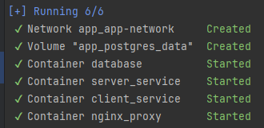
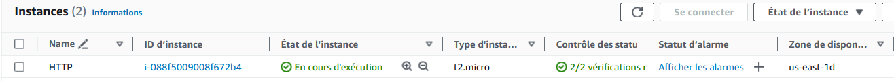

# Rapport de projet
### Panorama du cloud & déploiement AWS

## Étape 1 : Préparation du projet
### 1.1 Choix du projet
Pour le projet existant à utiliser, nous avons choisi un projet web. 
Un **front-end** développé en [React.js](https://fr.react.dev/) et un back-end API en [Nest.js](https://nestjs.com/), [Prisma ORM](https://www.prisma.io/) et [GraphQL](https://graphql.org/).  
Le site web est une reproduction du blog [Medium.com](https://medium.com/).

La page d'accueil :


Lien du dépôt : [ICI](https://github.com/EFREI-M1-Dev/GraphQL-Eval-FLMP)
  
<hr>

## Étape 2 : Docker
### 2.1 Dockerfile
Les trois Dockerfile sont dans le dossier `app/<nom>` (`<nom>` = client, nginx ou server).

### 2.2 docker-compose.yml
Le fichier [docker-compose.yml](app/docker-compose.yml) est dans le dossier `app`.

Commande d'exécution : 
```sh
docker compose -f "app/docker-compose.yml" up -d --build
```

Résultat après avoir exécuté la commande : 


Résultat sur `localhost:5173` : 


<hr>

## Étape 3 : Docker Swarm

### 3.1 Le script de déploiement avec multipass et docker swarm : 
Bientôt disponible!

<hr>

## Étape 4 : Terraform et Ansible avec AWS
### 4.1 Informations de connexion
1. Récupérer l'**access key** et la **secret key** de votre compte AWS.
2. Créer depuis l'interface AWS une **key pair** nommé **"myKey"** pour pouvoir se connecter à l'instance EC2. Puis télécharger le fichier `.pem` et le placer le à la racine du projet.

### 4.2 Terraform
Une fois les informations de connexion récupérées, il n'y a plus qu'à 

Commandes à exécuter : 
```sh
cd terraform
docker build -t terraform .
docker run --rm -w /workspace terraform apply -auto-approve
```

Si toutes les informations demandées sont correctes, et une fois l'exécution réussi, la nouvelle instance a bien été créée sur AWS.




### 4.3 Ansible

```sh
docker image build -t ansible:2.16 . 
docker container run --rm ansible:2.16 ansible-playbook -i inventory.ini playbook.yml

```